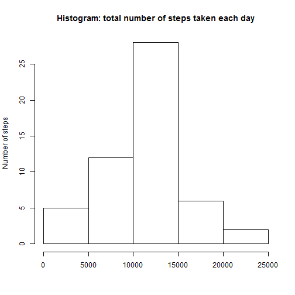
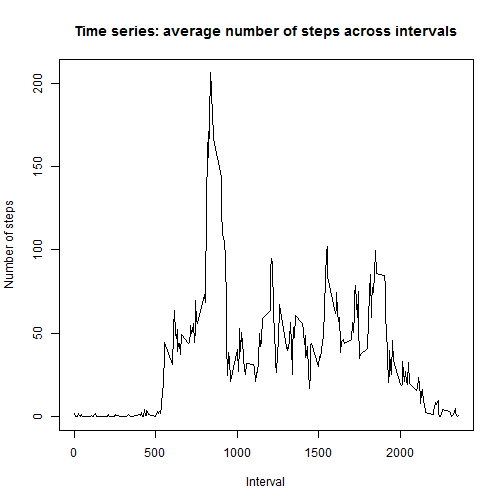
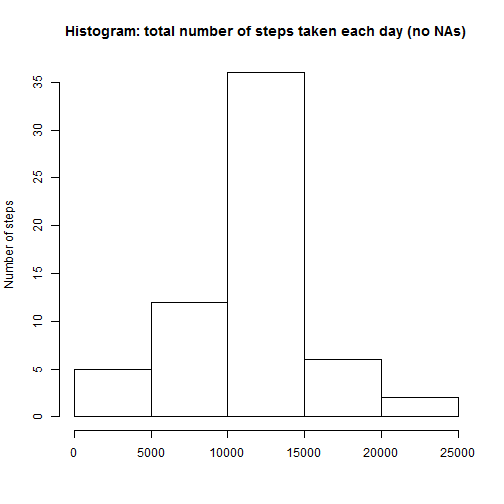
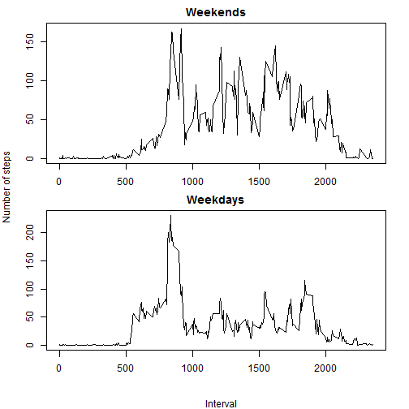

---
title: 'Reproducible Research: Peer Assessment 1'
author: "Ganna Kaplun"
date: "Thursday, August 14, 2014"
output: html_document
---  
  
### Loading and preprocessing the data


Reading the data with basic date preprocessing (note that downloading and unzipping the data is performed as well but the code is not given explicitly in this article):

```r
data <- read.csv("data/activity.csv", na.strings="NA")
data$date <- as.Date(data$date, format="%Y-%m-%d")
```

### What is mean total number of steps taken per day?

1. Make a histogram of the total number of steps taken each day.  

The only additional step to be performed is to prepare the data required for the histogram, i.e. the total number of steps per date (stored in 'steps_per_date' variable).


```r
steps_per_date <- aggregate(steps ~ date, data, FUN=sum)
hist(steps_per_date$steps, main = "Histogram: total number of steps taken each day", ylab = "Number of steps", xlab = "")
```

 

2. Calculate and report the **mean** and **median** total number of steps taken per day.

```r
mean(steps_per_date$steps)
```

```
## [1] 10766
```

```r
median(steps_per_date$steps)
```

```
## [1] 10765
```

### What is the average daily activity pattern?

1. Make a time series plot (i.e. type = "l") of the 5-minute interval (x-axis) and the average number of steps taken, averaged across all days (y-axis).

This plot requires similar preparation step as described above (calculating 'avg_steps_per_interval' variable).

```r
avg_steps_per_interval <- aggregate(steps ~ interval, data, FUN=mean)
plot(avg_steps_per_interval, type = "l", main = "Time series: average number of steps across intervals", ylab = "Number of steps", xlab = "Interval")
```

 

2. Which 5-minute interval, on average across all the days in the dataset, contains the maximum number of steps?

```r
avg_steps_per_interval$interval[which.max(avg_steps_per_interval$steps)]
```

```
## [1] 835
```
It means that this interval starts at 835th minute.

### Imputing missing values

1. Calculate and report the total number of missing values in the dataset (i.e. the total number of rows with NAs).

```r
sum(is.na(data))
```

```
## [1] 2304
```

2. Devise a strategy for filling in all of the missing values in the dataset. The strategy does not need to be sophisticated. For example, you could use the mean/median for that day, or the mean for that 5-minute interval, etc.  

As a strategy for this step I used the average number of steps per 5-minute interval as the corresponding additional step was calculated before to construct the time series plot (you can see it above, 'avg_steps_per_interval' variable).

3. Create a new dataset that is equal to the original dataset but with the missing data filled in.

```r
data_no_NA <- data
for (i in 1:nrow(data_no_NA)) {
      if (is.na(data_no_NA$steps[i])) {
            data_no_NA$steps[i] <- avg_steps_per_interval$steps[avg_steps_per_interval$interval == data_no_NA$interval[i]]
      }
}
```

4. Make a histogram of the total number of steps taken each day and calculate and report the **mean** and **median** total number of steps taken per day. Do these values differ from the estimates from the first part of the assignment? What is the impact of imputing missing data on the estimates of the total daily number of steps?

```r
steps_per_date_no_NA <- aggregate(steps ~ date, data_no_NA, FUN=sum)
hist(steps_per_date_no_NA$steps, main = "Histogram: total number of steps taken each day (no NAs)", ylab = "Number of steps", xlab = "")
```

 

```r
mean(steps_per_date_no_NA$steps)
```

```
## [1] 10766
```

```r
median(steps_per_date_no_NA$steps)
```

```
## [1] 10766
```

```r
quantile(data$steps, probs = seq(0, 1, 0.1), na.rm = T)
```

```
##   0%  10%  20%  30%  40%  50%  60%  70%  80%  90% 100% 
##    0    0    0    0    0    0    0    0   28   86  806
```

```r
quantile(as.integer(data_no_NA$steps), probs = seq(0, 1, 0.1))
```

```
##   0%  10%  20%  30%  40%  50%  60%  70%  80%  90% 100% 
##    0    0    0    0    0    0    0   14   41   84  806
```

As quantile analysis and histogram shows, the total number of steps has obviously increased as each NA value has been replaced with the mean (as described according to the strategy), i.e. the number equal or greater than zero. That's why the histogram has one more label for number of steps (35) in comparison with the one built for the dataset with NAs. The mean and median has not changed a lot comparing to the initial dataset. As far as I can see, there are several reasons:

- the number of NAs is not that great in the initial dataset and many of them are replaced with zeros according to the chosen strategy (can be seen from quantiles);
- the number of steps in the dataset without NAs is not rounded, truncated or converted to integer while processing (this step if performed will probably lead to greater change in mean and median as the error will accumulate with these operations).

### Are there differences in activity patterns between weekdays and weekends?

1. Create a new factor variable in the dataset with two levels - "weekday" and "weekend" indicating whether a given date is a weekday or weekend day.

```r
days_test <- function() {
      weekdays <- character()
      for (i in 1:nrow(data_no_NA)) {
            if (weekdays(data_no_NA$date[i]) %in% c("Saturday", "Sunday")) {
                  weekdays <- c(weekdays, "weekend")
            } 
            else {
                  weekdays <- c(weekdays, "weekday")
            }
      }
      weekdays
}
data_no_NA_weekdays <- cbind(data_no_NA, as.factor(days_test()))
names(data_no_NA_weekdays) <- c("steps", "date", "interval", "weekday")
```
This preprocessing is required to build the following panel plot.

2. Make a panel plot containing a time series plot (i.e. type = "l") of the 5-minute interval (x-axis) and the average number of steps taken, averaged across all weekday days or weekend days (y-axis).  

The additional steps before constructing the plot are similar to those conducted for other plots above.

```r
avg_steps_per_weekday <- aggregate(steps ~ interval, subset = (weekday == "weekday"), data_no_NA_weekdays, FUN=mean)
avg_steps_per_weekend <- aggregate(steps ~ interval, subset = (weekday == "weekend"), data_no_NA_weekdays, FUN=mean)

par(mfrow = c(2, 1), oma = c(3, 3, 0, 0), mar = c(2, 1, 2, 2))
plot(avg_steps_per_weekend$interval, avg_steps_per_weekend$steps, type = "l", main = "Weekends", xlab = '', ylab = '')
plot(avg_steps_per_weekday$interval, avg_steps_per_weekday$steps, type = "l", main = "Weekdays", xlab = '', ylab = '')
mtext("Interval", side = 1, outer = T, line = 2)
mtext("Number of steps", side = 2, outer = T, line = 2)
```

 
